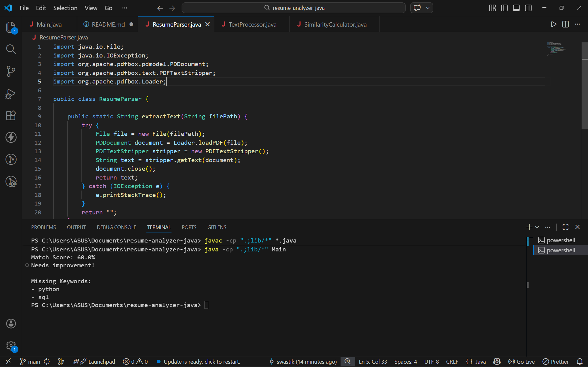

# resume-analyzer-java
# AI Resume Analyzer (Java)

## 📌 Description
This project is a Java-based application that analyzes a resume and compares it with a job description. It calculates a match score and identifies missing keywords to help improve the resume.

---

## 🎯 Features
- Extracts text from PDF resumes
- Compares resume with job description
- Calculates match score (%)
- Displays missing keywords
- Simple and easy to use

---

## 🛠️ Technologies Used
- Java
- Apache PDFBox
- File Handling
- Basic NLP (keyword matching)

---

## 📂 Project Structure
resume-analyzer-java/
│── Main.java
│── ResumeParser.java
│── TextProcessor.java
│── SimilarityCalculator.java
│── sample_job.txt
│── resume.pdf
│── lib/
│    └── pdfbox-app-2.x.x.jar

---

## ▶️ How to Run

### Compile
javac -cp ".;lib/*" *.java

### Run
java -cp ".;lib/*" Main

*(For Mac/Linux use ":" instead of ";" in classpath)*

---

## 📊 Sample Output
Match Score: 70%
Missing Keywords:
- python
- sql

---

## 📸 Screenshot
 Output Screenshot

---

## 🚧 Challenges Faced
- Handling PDF parsing
- Managing external libraries
- Text preprocessing

---

## 🔮 Future Improvements
- Add GUI using Java Swing
- Improve accuracy using advanced NLP
- Add better keyword filtering

---

## 👨‍💻 Author
Swastik Pandey